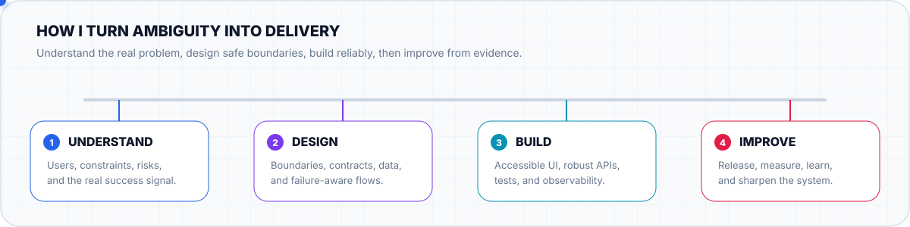

<picture>
  <source media="(prefers-color-scheme: dark)" srcset="./assets/profile-hero-dark.svg" />
  <source media="(prefers-color-scheme: light)" srcset="./assets/profile-hero-light.svg" />
  
</picture>

  
  
  

  <strong>Cairo, Egypt</strong> · Web, mobile, real-time, data, and AI-assisted product engineering

---

## The 20-second version

- **What I am —** A Full Stack Engineer who works beyond individual tickets, turning product requirements into maintainable systems and production-ready experiences.
- **What I build —** Responsive web platforms, cross-platform mobile products, APIs, analytics workflows, real-time experiences, and AI-enabled applications.
- **How I work —** Product-first, architecture-aware, evidence-driven, and accountable from the first decision through release and iteration.

> **I do not only implement screens. I connect product intent, interface design, backend rules, data, delivery, and the feedback loop that makes a system better.**

<picture>
  <source media="(prefers-color-scheme: dark)" srcset="./assets/engineering-loop-dark.svg" />
  <source media="(prefers-color-scheme: light)" srcset="./assets/engineering-loop-light.svg" />
  
</picture>

---

# Flagship engineering work

## 01 — Jahiz Analytics

### A cross-platform karate performance product built around real competition workflows

**Jahiz Analytics** turns live karate match activity into structured history, athlete context, tournament workflows, and actionable performance analytics for coaches and athletes.

**Product scope**

- Live, timer-aware match logging
- Coach and athlete experiences
- Player, team, and tournament workflows
- Match review and analytics presentation

**Engineering ownership**

- Angular, Ionic, Capacitor, and TypeScript
- Node.js APIs and PostgreSQL workflows
- Role-aware rules, authentication, and subscriptions
- CI/CD, mobile release preparation, testing, and production diagnostics

  
  

> The production source and private services remain private. The public repository presents real product flows, engineering decisions, screenshots, architecture, and recruiter-facing evidence without exposing proprietary code.

---

## 02 — Requra.AI

### Evidence-grounded requirements engineering across documents, meetings, stakeholders, and AI workflows

<a href="https://github.com/Requra">
  <picture>
    <source media="(prefers-color-scheme: dark)" srcset="https://raw.githubusercontent.com/Requra/ai-pipeline/main/docs/assets/readme/requra-hero-dark.svg" />
    <source media="(prefers-color-scheme: light)" srcset="https://raw.githubusercontent.com/Requra/ai-pipeline/main/docs/assets/readme/requra-hero-light.svg" />
    
  </picture>
</a>

**Requra.AI** transforms project documents, transcripts, meeting audio, and notes into traceable requirements, user stories, acceptance criteria, evidence, quality findings, stakeholder feedback, and delivery-ready exports.

**Frontend product engineering**

- React 19, TypeScript, Vite, and React Router
- TanStack Query, Zustand, Axios adapters, and polling
- React Hook Form, Zod, Tailwind CSS, and accessible UI systems
- Projects, analysis states, evidence, reviews, exports, and live meetings

**System integration**

- Typed boundaries between React, the .NET backend, and AI services
- Explicit queued, processing, partial, rejected, failed, and retry states
- Deterministic demo infrastructure using MSW
- Production-service isolation and failure-aware UX

  
  
  

---

# What I can own end to end

1. **Product UI —** Design systems, responsive interfaces, complex forms, state management, accessibility, animation, and performance.
2. **Application logic —** Feature boundaries, domain workflows, authentication, permissions, error states, and maintainable TypeScript architecture.
3. **APIs and data —** REST contracts, backend services, PostgreSQL, MongoDB, Redis, validation, analytics, and asynchronous processing.
4. **Delivery —** Git workflows, Docker, CI/CD, cloud deployments, mobile builds, testing, observability, and release safety.

  
<strong>Technical toolbox — expand for the full map</strong>

   

- **Frontend:** Angular, React, Next.js, TypeScript, JavaScript, RxJS, TanStack Query, Zustand, NgRx
- **UI engineering:** HTML, CSS, SCSS, Tailwind CSS, Ionic, responsive design, accessibility, GSAP, Framer Motion
- **Backend:** Node.js, Express, NestJS, REST APIs, authentication, authorization, real-time workflows
- **Data:** PostgreSQL, MongoDB, Redis, relational modeling, querying, indexing, analytics, reporting
- **AI integration:** Typed AI-service contracts, asynchronous jobs, evidence flows, human-in-the-loop UX, LangChain exploration
- **Delivery:** Git, GitHub Actions, Docker, Linux, cloud deployments, mobile release workflows, testing, and diagnostics

---

# The athlete edge

I am also an **Egyptian national karate champion**. Competitive sport shaped how I approach engineering: stay calm under pressure, examine performance honestly, repeat hard work until it becomes reliable, and take responsibility for the result—not only the effort.

> **Discipline over temporary motivation. Evidence over ego. Consistency over noise.**

<strong>🥋 Train · 💻 Build · 🔍 Review · 📈 Improve</strong>

---

# A fast path for recruiters

- **30 seconds —** Read the summary and scan the two flagship products.
- **2 minutes —** Open the [Jahiz product showcase](https://github.com/shawky2002020/jahiz-analytics-showcase) or the [Requra interactive demo](https://requra-demo-rust.vercel.app/demo).
- **5–10 minutes —** Read the [Jahiz engineering case study](https://github.com/shawky2002020/jahiz-analytics-showcase/blob/main/docs/ENGINEERING_CASE_STUDY.md) and inspect the [Requra frontend architecture](https://github.com/Requra/frontend).
- **Full review —** Visit [shawkyelsayed.com](https://www.shawkyelsayed.com) and connect through [LinkedIn](https://www.linkedin.com/in/shawky-elsayed).

---

## Build products that deserve to reach users.

**Full Stack Engineering · Product Ownership · Athlete Mentality**

 

